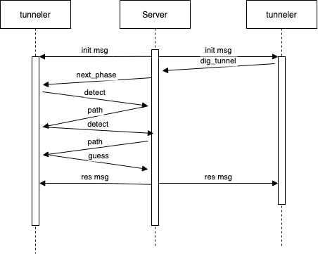

# Dig That 

## New Anouncement
- I noticed that the websocket used in the original card-nim php server is not the correct form of websocket. So it can have unpredictable problems when sending long data to browser(GUI). Considering the excessive effort required to refactor the php server. I currently have no plans to fix the GUI. If anyone is particularly interested in seeing the GUI results for particular matches, I will refactor the php server and run the corresponding match results in the future after I have a lot of free time.

> Team brute force

This contains a server using basic sockets and a series of simple clients to play dig that

## Running the server

To run the server on localhost, from the top level, use the following command:

```php server.php [port] [grid_number] [number_of_phases] [length_of_the_path]```

If you include a ```-o``` on the end, you can connect a websocket observer first as well.

## Playing via Python, Java, and C++

To use these clients, after the server is up and running, run them with an optional command line argument for port number

5000 is the default port number for these clients

## Observer

The obverser is a vue client

Try following commands to open it, it is only allowed listened with port **5000**

```
$ cd observer/observer
$ npm install
$ npm run serve
```

## Sequenece chart



## Contact

Liren Gao : lg3405@nyu.edu

Dengtai Wang: dw2691@nyu.edu

For questions about the code or bugs send an email to Liren and cc Dengtai.


