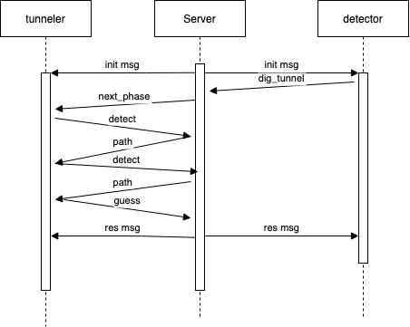

# Dig That 

> Team brute force

This contains a server using basic sockets and a series of simple clients to play dig that

## Running the server

To run the server on localhost, from the top level, use the following command:

```php server.php [port] [grid_number] [number_of_phases] [length_of_the_path]```

(not implemented yet)If you include a ```-o``` on the end, you can connect a websocket observer first as well.

Open ```iframe.html``` after starting the server to watch the two other clients play.

## Playing via Python, Java, and C++

To use these clients, after the server is up and running, run them with an optional command line argument for port number

5000 is the default port number for these clients

## Sequenece chart



## Contact

Liren Gao : lg3405@nyu.edu

Dengtai Wang: dw2691@nyu.edu

For questions about the code or bugs send an email to Liren and cc Dengtai.


